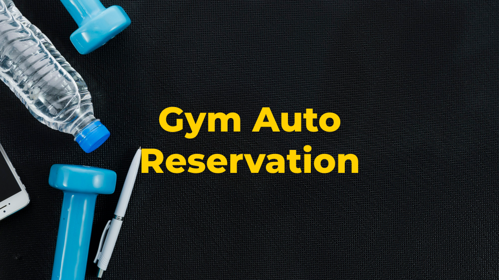
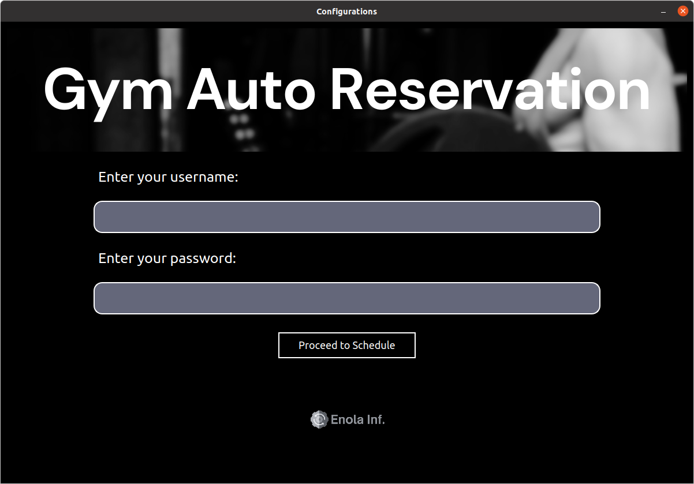
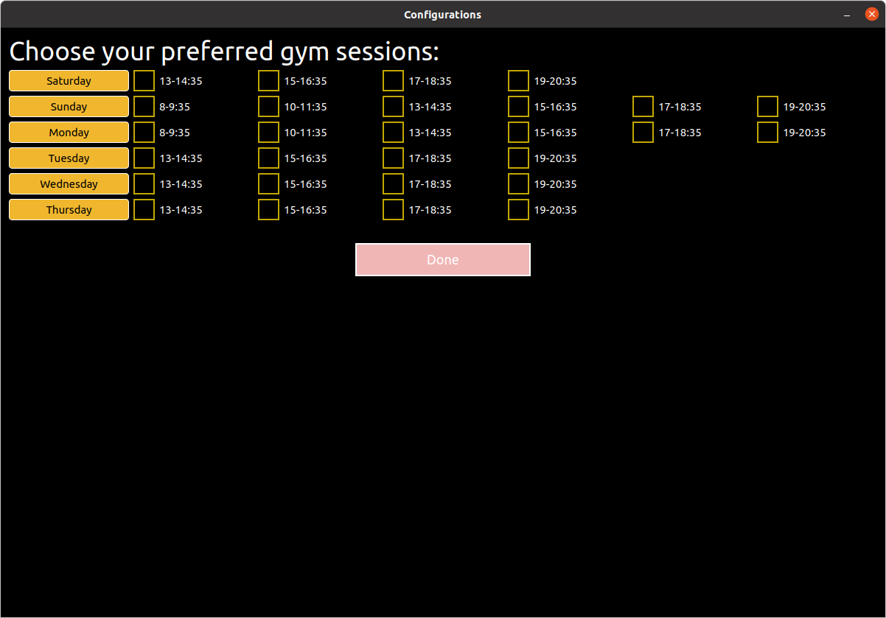

# Gym_Automation
<div style="margin-bottom: 20px;">
    <a href="https://samad.aut.ac.ir/index.rose">
        
    </a>
</div>
<br>

A Gym Automation project designed to book preferred gym sessions within the [AUT University portal](https://samad.aut.ac.ir/index.rose) using Python.


<div align="left">
  
  
  
</div>

## Table of Contents


## Introduction

The `Gym Automation` project is a Python-based application tailored to streamline the gym session reservation process. Leveraging Selenium for automation and a PyQt5-based user interface, users can securely input their login credentials and effortlessly select their desired gym sessions. The project aims to provide a user-friendly, automated solution for efficient and secure gym session reservations.

<a href="#">&#9650;Back</a>

## Features

- **Selenium Automation**: Automates gym session reservations through the samad.aut.ac.ir website.
- **Secure Credentials Handling**: Encrypts and stores user credentials for secure login.
- **Flexible Session Selection**: Allows users to select preferred gym sessions for reservation.
- **Informative Logging**: Provides logs to track the reservation process, errors, and successes.
- **Configurable and Extensible**: Modular code structure for easy maintenance and further feature additions.

<a href="#">&#9650;Back</a>

## Prerequisites

### Installation and Environment Setup

- **Python Installation**: Ensure you have a compatible version of Python installed. If not, download and install Python from the [official Python website](https://www.python.org/downloads/).

- **Package Installation**: Install the necessary Python packages using the provided `requirements.txt` file by running:
  ```sh
  pip install -r requirements.txt

### ChromeDriver Setup
Download and configure ChromeDriver for your system to work with Selenium.

<a href="#">▲Back</a>

## Project Structure
The project structure separates different functionalities into various modules:

- `main.py`: Orchestrates the main logic for gym session reservations and handles the Selenium automation process.
- `utils.py`: Contains utility functions for encrypting and decrypting credentials, reading/writing preferred session data to JSON files, and other miscellaneous functions.
- `checkbox_input.py`: Stores information about available gym sessions for different days and times.
- `gui.py`: Implements the graphical user interface using PyQt5 for user login and session selection.
- `logger.py`: Sets up logging configurations to manage logs in the application.
- `styles.py`: Contains various style configurations for PyQt5 widgets used in the GUI.

<a href="#">▲Back</a>

## Usage
1. Set up a server and run the application on it, or simply turn on your laptop and execute the main.py file. The first time you run the main.py file, a window will appear, prompting you to enter your username and password associated with your samad.aut.ac.ir account:
   
    

    
2. After entering your password and username, click on the `Proceed to Schedule` button. Another page will appear, allowing you to choose your preferred gym sessions for automation and click on `Next` button:
   
    

    
3. Now the automation process will start automatically and you can see the results in `Logs` directory.

4. [Optional] You can add `main.py` to start up in your ubuntu `crontab`, there are also alternative ways for windows.
   
<a href="#">▲Back</a>

## Contributing
Contributions are welcome! If you have suggestions, improvements, or bug fixes, feel free to open issues or pull requests.

<a href="#">▲Back</a>

## License
This project is licensed under the MIT License. See the LICENSE file for details.

<a href="#">▲Back</a>

<div align="center">
    Made with ❤️ by <a href=https://github.com/<YOUR-USERNAME>><saeed-at></a>
</div>
